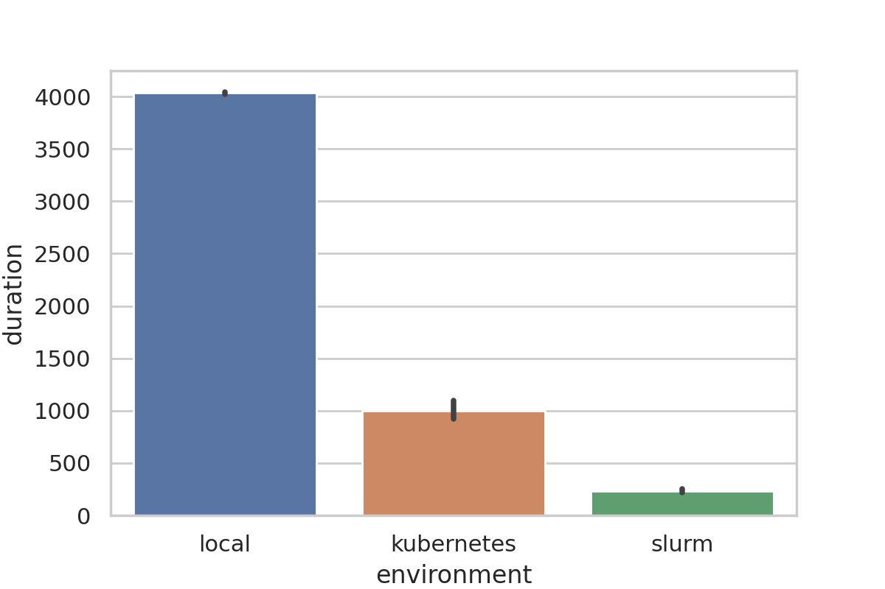

# Introduction {#sec:intro}

<!-- defining the problem of reproducibility in computational science -->

Around 48.6% of scientists and researchers working in various domains related to computational science, upload experimental artifacts like code, figures, datasets, configuration files, etc. on open-access repositories like Zenodo [@_zenodo_], Figshare [@_figshare_] or GitHub [@github]. 
Unfortunately, only 1.1% of the artifacts available online are fully reproducible and 0.6% of them are partially reproducible [@stagge2019assessing]. 
According to a study of 2016 by Nature, among a group of 1576 scientists around 70% of them failed to reproduce each other's experiments [@baker2016reproducibility].
This problem occurs mostly due to the lack of proper documentation, missing artifacts, broken software dependencies, etc. 
This results in other researchers wasting time trying to figure out how to reproduce those experiments from the archived artifacts, ultimately making this process inefficient, cumbersome, and error-prone [@sep-scientific-reproducibility].

<!-- discuss previous work -->

Numerous existing research has tried to address the problem of reproducibility [@goodman2016does] in distinct ways like logging and tracing system calls, using workflow engines, using correctly provisioned shared and public testbeds, by recording and replaying changes from a stable initial state, etc [@reproducibility2018acm] and these led to the development of various tools and frameworks [@piccolo2016tools] [@peng2011reproducible].
Scientific workflow engines have been a predominant solution [@stevens2013automated] [@banati2015minimal] [@qasha2016framework] for handling the reproducibility problem by organizing the steps in a complex scientific workflow as the nodes of a directed acyclic graph (DAG) and executing them in the correct order [@albrecht2012makeflow].
Nextflow [@ditommaso_nextflow_2017], Pegasus [@deelman_pegasus_2004] and Taverna [@oinn_taverna_2004] are examples of widely used scientific workflow engines.
But some phenomena like unavailability of third-party services, missing example input data, changes in the execution environment, insufficient documentation of workflows make it difficult for scientists to reuse workflows, thus causing what is known as _workflow decay_ [@workflow_decay].

<!-- attempts to solves using containers and what problem still remains -->

One of the main reasons behind _workflow decay_ is the differences in the environment where the workflows are developed and where they are reproduced [@meng2017facilitating]. 
VM's were used to address this problem for some time due to their high isolation guarantees, where every step of a workflow ran inside a separate VM [@howe2012virtual] [@virtandnestedvirt2012].
Since VM's had large resource footprints, researchers replaced VM's with software containers, i.e. light-weight virtualization technologies to provide platform-independent reproducibility [@barik2016performance] [@sharma2016containers].
Although software (Linux) containers are a relatively old technology [@menage_adding_2007], it was not until recently, with the rise of Docker, that they entered mainstream territory [@bernstein_containers_2014]. 
Since then, this technology has transformed the way applications get deployed in shared infrastructures, with 25% of companies using this form of software deployment [@datadog_surprising_2018], and a market size projected to be close to 5B by 2023 [@marketsandmarkets_application_2018]. 
Docker has been the de facto container runtime, with other container runtimes such as Singularity [@kurtzer_singularity_2017], Rkt [@rktcommunity_rkt_2019], Charliecloud [@priedhorsky_charliecloud_2017], and Podman [@podmancommunity_containers_2019] having emerged. 
The Linux Foundation bootstrapped the Open Container Initiative (OCI) [@opencontainerinitiative_new_2016] and is close to releasing version 1.0 of a container image and runtime specifications. 
With Docker, the container-native software development paradigm emerged, which promotes the building, testing, and deployment of software in containers, so that users do not need to install and maintain packages on their machines, rather they can build or fetch container images which have all the dependencies present. 
Since these container runtimes are available for almost every well known operating system and architecture, experiments can be reproduced easily using containerized workflows in almost any environment [@stubbs2016endofday] [@zheng_integrating_2015].
Although there are different container engines available, switching between them is difficult as they have different API's, image formats, CLI interfaces, among many others.
Also, there is an absence of tools that allow running containerized workflows in an engine agnostic way.
It has also been found that as scientific workflows become increasingly complex, continuous validation of the workflows which is critical to ensuring good reproducibility, becomes difficult [@deelman2018future] [@cohen2017scientific].
Currently, different container-based workflow engines are available but all of them assume the presence of a fully provisioned Kubernetes [@kubernetes_google] cluster.
The practice of running applications and workflows in Kubernetes is commonly referred to as cloud-native [@balalaie2016microservices]. 
The difference between cloud-native and container-native is that, in the former, a Kubernetes cluster is required, while in the latter, only a container engine is required.
Argo [@argocommunity_argoproj_2019], Pachyderm [@novella_containerbased_2018], and Brigade [@brigade] are popular examples of cloud-native workflow execution engines.
The presence of a Kubernetes cluster or a cloud computing environment should not be a hardcore requirement for reproducing any experiment in a container-native manner since it is often costly [@rodriguez2020container] to get access to one and this, in turn, makes reproducibility complex. 
It would be more convenient for researchers if workflow engines provide the flexibility of running workflows in a wide range of computing environments including those of their choice. 

<!-- our contributions -->

Popper [@systemslabpopper] is a light-weight workflow execution engine that allows users to follow the container-native paradigm for building reproducible workflows from archived experimental artifacts. 
This paper makes the following contributions:

1. The design and architecture of a container-native workflow engine that abstracts multiple resource managers and container engines giving users the ability to focus only on Dockerfiles, i.e. software dependencies and workflow logic, i.e. correct order of execution, and ignore the runtime specific details.
   This arrangement also provides built-in support for continuous validation and portability of workflows which empowers researchers to develop workflows once and run interchangeably between CI services like Travis, Jenkins, etc. and the local machine without any modifications. 

2. Popper, an implementation of the above design that allows running workflows inside containers in different computing environments like local machines, Kubernetes clusters, or HPC [@yang2005high] environments.

3. Three case studies on how Popper can be used to quickly reproduce complex workflows in different computing environments. 
   We show how an entire Machine Learning workflow can be run on a local machine during development and how it can be reproduced in a Kubernetes cluster with GPUs to scale up and collect results. 
   We also show how an HPC workflow developed on the local machine can be reproduced easily in a SLURM [@slurm] cluster.

# Popper 2.0 {#sec:popper}

## Motivation

Let us take a relatively simple scenario where users have a list of single-purpose tasks in the form of scripts and they want to automate running them in containers in some sequence.
To accomplish this goal of running a list of containerized tasks using existing workflow engines, users need to learn a specific workflow language, deploy a workflow engine service, and learn to execute workflows on that service.
These tasks may not be always trivial to accomplish if we assume the only thing users should care about is writing experimentation scripts and running them inside containers.
As in our example workflow shown in @Sec:casestudy, we have three high-level scripts, `download_dataset.py`, `verify_dataset.sh`, and `run_training.sh` to download the dataset, verify it and run the training respectively.
To make a workflow out of these scripts and run with Popper, one needs to install the Popper executable, find out images or write Dockerfile's with all the required dependencies, arrange them into a YAML file, and execute a `popper run`.
Popper will run the scripts sequentially inside containers as individual steps. 
Users can also customize the container engine and resource manager according to their needs through a YAML based configuration file.

## Background

In this section, we provide a background on the different tools and technologies that are crucial to Popper for building container-native and reproducible workflows.

### **Docker**

Docker is an industry-standard daemon based light-weight virtualization technology that was released in early 2013.
It uses various Linux kernel features like namespaces and cgroups to segregate processes so that they can run independently.
It provides state of the art isolation guarantees and makes it easy to build, deploy, and run applications using containers following the OCI (Open Container Initiative) [@oci] specifications. 
However, it was not designed for use in multi-user HPC environments and also has significant security issues [@yasrab2018mitigating], which might enable a user inside a Docker container to have root access to the host systems network, filesystem, processes, etc. thus making it unsuitable for use in HPC systems. 
Also, Docker uses cgroups [@rosen2013resource] to isolate containers, which conflicts with the SLURM scheduler since it also uses cgroups to allocate resources to jobs and enforce limits [@brayford2019deploying].

### **Singularity**

Singularity is a daemon less scientific container technology built by LBNL (Lawrence Berkley National Laboratory) and first released in 2016. 
It is designed to be simple, fast, secure, and provides containerized solutions for HPC systems supporting several HPC components such as resource managers, job schedulers and contains native MPI [@mpi1993] features. 
One of the main goals of Singularity is to bring container technology and reproducibility to the High-Performance Computing world. 
The key feature that differentiates it from Docker is that it can be used in non-privileged computing environments like the compute nodes of HPC clusters, without any modifications to the software. 
It also provides an abstraction that enables using container images from different image registries interchangeably like Docker Hub, Singularity Hub, and Sylabs Cloud.
These features make Singularity increasingly useful in areas of Machine learning, Deep learning, and other data-intensive applications where the workloads benefit from the HPC support of it.

{#fig:casestudy}

### **SLURM**

SLURM is an open-source cluster resource management and job scheduling system developed by LLNL (Lawrence Livermore National Laboratory) for Linux clusters ranging from a few nodes to thousands of nodes. 
It is simple, scalable, portable, fault-tolerant, secure, and interconnect agnostic. 
It is used as a workload manager by almost 60% of the world's top 500 supercomputers [@ibrahim2017algorithms]. 
SLURM provides a plugin-based mechanism for simplifying its use across different computing infrastructures.
It enables both exclusive and non-exclusive allocation of resources like compute nodes to the users. 
It provides a framework for starting, executing, and monitoring parallel jobs on a set of allocated nodes and arbitrate conflicting requests for resources by managing a queue of pending work. 
SLURM runs as a daemon in the compute nodes and also provides an easy to use CLI interface.

### **Kubernetes**

Kubernetes is a production-grade open-source container orchestration system written in Golang that automates many of the manual processes involved in deploying, scaling, and managing of containerized applications across a cluster of hosts. 
A cluster can span hosts across public, private, or hybrid clouds. 
This makes Kubernetes an ideal platform for hosting cloud-native applications. 
Kubernetes supports a wide range of container runtimes including Docker, Rkt, and Podman. 
It was originally developed and designed by engineers at Google and it is hosted and maintained by the CNCF (Cloud Native Computing Foundation). 
Many cloud providers like GCP, AWS, and Azure provide a completely managed and secure hosted Kubernetes platform.

### **Continuous Integration**

Continuous Integration is a software development paradigm where developers commit code into a shared repository frequently, ideally several times a day.
Each integration is verified by automated builds and tests of the corresponding commits.
This helps in detecting errors and anomalies quickly and shortens the debugging time [@virmani2015understanding].
Several hosted CI services like Travis, Circle, and Jenkins make continuous integration and continuous validation easily accessible.

## Workflow Definition Language

YAML [@ben2009yaml] is a human-readable data-serialization language. 
It is commonly used in writing configuration files and in applications where data is stored or transmitted. 
Due to its simplicity and wide adoption [@yaml_wide_adoption], we chose YAML for defining popper workflows and for specifying the configuration for the execution engine. 
An example of a popper workflow is shown below.

```yml
steps:
- id: download data
  uses: docker://byrnedo/curl
  args: [
    "--create-dirs",
    "-Lo data/global.csv",
    "https://github.com/datasets/co2-fossil-global/raw/master/global.csv"
  ]

- id: run analysis
  uses: docker://python:alpine
  args: [
    "scripts/get_mean_by_group.py",
    "data/global.csv", "5"
  ]

- id: validate results
  uses: docker://python:alpine
  args: [
    "scripts/validate_output.py",
    "data/global_per_capita_mean.csv"
  ]
```

A popper workflow consists of a series of syntactical components called steps, where each step represents a node in the workflow DAG, with a `uses` attribute specifying the required container image. 
The `uses` attribute can reference Docker images hosted in container image registries; filesystem paths for locally defined container images (Dockerfiles); or publicly accessible GitHub repositories that contain Dockerfiles. 
The commands or scripts that need to be executed in a container can be defined by the `args` and `runs` attributes. 
Secrets and environment variables needed by a step can be specified by the `secrets` and `env` attributes respectively for making them available inside the container associated with a step.
The steps in a workflow are executed sequentially in the order in which they are defined.

## Workflow Execution Engine

The Popper workflow execution engine is composed of several components that talk to each other during workflow execution.
The vital architectural components of the system are described in detail throughout this section.
The architecture of the Popper workflow engine is shown in @Fig:arch;

### Command Line Interface (CLI)

Besides allowing users to communicate with the workflow runner, the CLI allows visualizing workflows by generating DOT diagrams [@dot] like the one shown in @Fig:casestudy;
generates configuration files for continuous integration systems, e.g. TravisCI, Jenkins, Gitlab-CI, etc. so that users can continuously validate their workflows;
provides dynamic workflow variable substitution capabilities, among others.

### Workflow Definition and Configuration Parsers

The workflow file and the configuration file are parsed by their respective parser plugins at the initial stages of the workflow execution.
The parsers are responsible for reading and parsing the YML files into an internal format;
running syntactic and semantic validation checks;
normalizing the various attributes and generating a workflow DAG.
The workflow parser has a pluggable architecture that allows adding support to other workflow languages.

### Workflow Runner

The Workflow runner is in charge of taking a parsed workflow representation as input and executing it.
It also downloads actions referenced by the steps in a workflow, checks the presence of secrets that are required by a workflow, and routes the execution of a step to the configured container engine through the requested resource manager. 
The runner also maintains a cache directory to optimize multiple aspects of execution such as avoid cloning repositories if they have been already cloned previously. 
Thus, this component orchestrates the entire workflow execution process.

### Resource Manager and Container Engine API

Popper supports running containers in both single-node and multi-node cluster environments. 
Each of these different environments has a very specific job and process scheduling policies. 
The resource manager API is a pluggable interface that allows the creation of plugins (also referred to as runners) for distinct job schedulers (e.g. SLURM, SGE, HTCondor, etc.) and cluster managers (e.g. Kubernetes, Mesos, YARN, etc.). 
Currently, plugins for SLURM and Kubernetes exist, as well as the default local runner that executes workflows on the local machine where Popper is executed.
Resource manager plugins provide abstractions for different container engines which allows a particular resource manager to support new container engines through plugins.
For example, in the case of SLURM, it currently supports running Docker and Singularity containers but other container engines can also be integrated like Charliecloud [@charliecloud] and Pyxis [@pyxis].
The container engine plugins abstract generic operations that all engines support such as creating an image from a `Dockerfile`;
downloading images from a registry and converting them to their internal format;
and container-level operations such as creation, deletion, renaming, etc.
Currently, there are plugins for Docker and Singularity, with others planned by the Popper community.

The behavior of a resource manager and a container engine can be customized by passing specific configuration through the configuration file.
This enables the users to take advantage of engine and resource manager specific features in a transparent way.
In the presence of a `Dockerfile` and a workflow file, a workflow can be reproduced easily in different computing environments only by tweaking the configuration file.
For example, a workflow developed on the local machine can be run on an HPC cluster using Singularity containers by specifying information about the available MPI library in the configuration file.
The configuration file can be passed through the CLI interface and can be shared among different workflows.
It can either be created by users or provided by system administrators.

{#fig:arch}

## Continuous Integration

Popper allows users to continuously validate their workflows by allowing them to export workflows as CI pipelines for different continuous integration services like Travis, Circle, Jenkins, etc.
The tool provides a `ci` subcommand that can be used to generate CI configuration files for different CI services.
To set up CI for a project using Popper, it is required to generate a CI configuration file, push the project to Github and enable the repository on the CI provider.

# Case Study {#sec:casestudy}

In this section, we present three case studies demonstrating how the Popper workflow engine allows reproducing and scaling workflows in different computing environments.
We analyzed the ML-based system benchmarking project MLPerf [@mattson2019mlperf] based on the reproducibility related issues that get frequently opened on its Github repository 
and categorized them into a few commonly occurring categories like missing or outdated versions of dependencies; outdated documentation; missing or broken links of datasets; etc.
These case studies aim to emphasize on how Popper can help in mitigating these reproducibility issues and make life easier for researchers and developers.
For these case studies, we built an image classification workflow that runs the training using Keras [@gulli2017deep] over the MNIST [@mnistdataset] dataset having 3 steps; download; verify; and train.
The workflow used for the case studies is depicted below.

```yaml
steps:
- id: download-dataset
  uses: docker://gw000/keras
  args: ["python", "./scripts/download_dataset.py"]

- id: verify-dataset
  uses: docker://alpine:3.9.5
  args: ["./scripts/verify_dataset.sh"]

- id: run-training
  uses: docker://gw000/keras
  args: ["./scripts/run_training.sh"]
```

The `download` step downloads the MNIST dataset in the workspace. 
The `verify` step verifies the downloaded archives against precomputed checksums.
The `train` step then starts training the model on this downloaded dataset and records the duration of the training.
The download and train steps use a Keras docker image and the verify step uses a lightweight alpine image.
Although a single docker image can be used in all the steps of a workflow, we recommend using images specific to the purpose of a step otherwise it could make dependency management complex, hence defeating the purpose of containers.

The general paradigm for building reproducible workflows with Popper usually consists of the following steps:
1. Thinking of the logical steps of the workflow.
2. Finding the relevant software packages required for the implementation of these steps.
  a. Finding images containing the required software from remote image registries like DockerHub, Quay.io, Google Container Registry, etc.
  b. If a prebuilt image is not available, a `Dockerfile` can be used to build an image manually which is a file containing specifications for building docker images.
3. Running the workflow and refining it.

### Workflow execution on the local machine

Popper aid researchers write, test, and debug workflows on their local development machines.
Researchers can iterate quickly by making changes and executing the `popper run` command to see the effect of their changes immediately.
We used an Apple Macbook Pro Laptop with a 2.4GHz quad-core Intel Core i5 64-bit processor and 8 Gb LPDDR3 RAM for this case study.
The image classification workflow was built and run on the MNIST dataset [@deng2012mnist] using the Docker container engine.
On single node machines, Popper leaves the job of scheduling the containerized steps to the host machines OS.
We ran the workflow 5 times with an overfitting patience of 5 on the laptop's CPU.
The results obtained over 5 executions have been shown in Figure III.
<!-- 
|  Iterations        | Time taken (in seconds)         | Epochs   | Accuracy  |
|--------------------|---------------------------------|----------|-----------| 
| 1                  |     4035                        |    12    |  99.16%  |
| 2                  |     4023                        |    11    |  99.18%  |
| 3                  |     4036                        |    12    |  99.17%  |
| 4                  |     4021                        |    11    |  99.15%  |
| 5                  |     4056                        |    13    |  99.14%  | -->

To achieve lower training durations, the training should ideally be done on GPUs in the cloud which in turn require these workflows to be easily portable to multi-node cloud environments.
In the next section, we will look at how we ran the workflow developed on the local machine efficiently on the Kubernetes using Popper.

### Workflow execution in the Cloud using Kubernetes

In this section, we discuss how we reduced the training duration in the above workflow by reproducing it on a GPU enabled Kubernetes cluster.
On Kubernetes clusters, steps of a Popper workflow run in separate pods that can get scheduled on any node of the cluster in a separate namespace.
Popper first builds the images required by the workflow and pushes them to an online image registry like DockerHub, Google Container Registry, etc.
Then a `PersistentVolumeClaim` is created to claim persistent storage space from a shared filesystem like NFS [@sandberg1985design] for the different step pods to share.
After the pod is created, the workflow context consisting of the scripts, configs, etc. is copied into the shared volume mounted inside the pod and executed.
Although any Kubernetes cluster can be used, for this case study, we used a 3-node Kubernetes cluster on Cloudlab [@CloudLab] each with an NVIDIA 12GB PCI P100 GPU.
The training pod used the single GPU of the node in which it was scheduled.
Reproducing the workflow developed on the local machine in the Kubernetes cluster only requires changing the resource manager specifications in the configuration file like specifying Kubernetes as the requested resource manager, specifying the `PersistentVolumeClaim` size, the image registry credentials, etc.
The training was configured with an overfitting patience of 5 and was allowed to run till it overfits similar to what was done for the local machine case study.

<!-- 
|  Iterations        | Duration (in seconds)         | Epochs   | Accuracy  |
|--------------------|---------------------------------|----------|-----------| 
| 1                  |     1194                        |    20    |  99.23%   |
| 2                  |     965                         |    17    |  99.20%   |
| 3                  |     1021                        |    20    |  99.24%   |
| 4                  |     894                         |    18    |  99.17%   |
| 5                  |     934                         |    19    |  99.34%   | -->

As we can see from Figure III, the average training duration was almost `1/4th` of what it took to train on the local machine.
This shows how Popper helps improve the performance of scientific workflows drastically by allowing easy reproduction in cloud infrastructure.

### Exascale workflow execution in SLURM clusters

For this case study, we modified our training script to use the Horovod [@horovod] distributed deep learning framework to facilitate training with MPI [@gropp1999using] in a slurm cluster.
For running workflows in SLURM clusters, MPI supported container engines like singularity, which is supported by popper need to be used.
Also, the programs and scripts need to be MPI compatible to enjoy the total compute capacity of multiple nodes in HPC clusters.
We recommend using a shared filesystem like NFS or AFS (Andrew File System) [@howard1988overview] mounted on each node and placing the workflow context in there to keep the workspace consistent across all the nodes.
We used 3 bare metal nodes from Cloudlab each with an NVIDIA 12GB PCI P100 GPU running Ubuntu 18.04 for this experiment and used singularity as the container engine for running this workflow.
We used `mpich` which is a popular implementation of MPI, with singularity following the bind approach, where we install MPI on the host and then bind mount the `bin`'s and `lib`'s of the MPI package inside the singularity container for the MPI version in the host and the container to stay consistent. 
The training conditions were exactly similar to the previous two case studies.

<!-- 
|  Iterations        | Duration (in seconds)         | Epochs   | Accuracy  |
|--------------------|-------------------------------|----------|-----------| 
| 1                  |     234                       |    19    |  98.72%   |
| 2                  |     262                       |    17    |  99.04%   |
| 3                  |     253                       |    21    |  98.88%   |
| 4                  |     201                       |    17    |  98.18%   |
| 5                  |     224                       |    19    |  98.63%   | -->

As we can see from Figure III, Popper allowed us to run the workflow in a SLURM cluster with MPI and hence utilize the processing power of multiple GPUs and drastically reduce the training duration.

### Setting up CI for our project

We pushed our example project to Github and activated the repository in Travis to setup CI on our project.
For long-running workflows like those consisting of ML/AI or BigData workloads, it is recommended to scale down various parameters like dataset size, epochs, etc with the help of environment variables to reduce the CI running time. 
For our example MNIST workflow, we reduced the number of epochs of the training to one and also cut the training data by 80%.
We used environment variables like `NUM_EPOCHS` and `DATASET_SIZE` to control the number of epochs and the size of training data for running in CI.
The `.travis.yml` file used by our case study is shown below. It can be generated by running `popper ci travis` from the command line.

```yaml
---
dist: xenial
language: python
python: 3.7
services: docker
install:
- git clone https://github.com/systemslab/popper /tmp/popper
- export PYTHONUNBUFFERED=1
- pip install /tmp/popper/src
script: popper run -f artifacts/local/.popper.yml -w artifacts/local
```

By setting up CI, users can continuously validate changes made to their workflows and also protect the workflows from getting outdated due to reasons such as outdated dependencies, outdated container images, broken links, etc.

# Results {#sec:result}

{#fig:casestudies}

A summary of the training duration and accuracy obtained by running the workflow in three different computing environment is shown in Figure @Fig:casestudies.
It can be seen from the graph how the portability of Popper workflows drastically reduces software development and debugging time by enabling developers and researchers to quickly iterate and test in different computing environments.

# Related Work

The problem of implementing multi-container workflows as described in @Sec:intro is addressed by several existing tools.
We briefly survey some of these tools and technologies and compare them with Popper 2.0 by grouping them in categories.

## Workflow definition languages

Standard workflow definition languages like CWL [@amstutz2016common], WDL [@_openwdl_], and YAWL [@van2005yawl] provide an engine agnostic interface for specifying workflows declaratively. 
Being engine agnostic, different workflow engines can adopt these languages as these workflow languages provide a plethora of useful syntactic elements to support a wide range of workflow engine features.
Some of these workflow definition languages provide syntax for fine-grained control of resources by the users like defining the amount of CPU and memory to be allocated to each step, specifying scheduling policies, etc.
Most of these languages support syntax for integration with various computing backends like container engines (e.g. Docker, uDocker [@gomes2018enabling], Singularity), HPC clusters (e.g. HTCondor [@tannenbaum2001condor], LSF [@wei2005implementing], SLURM), cloud providers (e.g. AWS, GCP, Azure), Kubernetes, etc.
For a user whose primary goal is to automate running a set of containerized scripts in sequence, learning these new workflow languages and syntaxes might add to the overall complexity.
One of Popper's primary goals is to minimize the workflow language overhead as much as possible by allowing users to specify workflows using vanilla YAML syntax, thus keeping the learning curve flat and preventing sources of confusion.

## Workflow execution engines

Workflow execution engines can be categorized in several different categories.
In this section, we have discussed three frequently used categories of workflow execution engines namely Generic, Cloud Native, and Container Native and compared their pros and cons with Popper.

### Generic workflow execution engines

Few examples of this category are stable and mature scientific workflow engines like Nextflow, Pegasus, and Taverna which have recently introduced support running steps in software containers;
Popular workflow engines like Airflow and Luigi [@_luigi_] require specifying workflows using programming languages and also provide pluggable interfaces that require the installation of separate plugins;
For example, Airflow and Luigi use Python, Copper [@_copper_engine_] use Java, Dagr [@_dagr_] use Scala and SciPipe [@lampa2019scipipe] use Go as their workflow definition language.
The goal with Popper is to minimize overhead both in terms of workflow language syntax and infrastructural requirements for running workflows and hence allow users to focus solely on writing the workflows.
The first issue is already addressed in the previous subsection, but it's also relevant here because not all engines support standard workflow languages such as CWL, and also learning specific programming languages for workflow execution seems like an exaggeration.
Most of these popular workflow engines like Pegasus, Airflow, and Luigi also require a standalone service that users need to learn how to deploy and interact with before executing workflows, thus adding to the complexity.
Popper also mitigates this issue as it can be downloaded and run as a standalone executable and does not assume any service deployment or infrastructural management before running workflows.

### Container native workflow execution engines

Container native paradigm encourages shifting the entire software development lifecycle which includes building, testing, debugging, and deployment to within software containers.
The workflow engines that assume running steps of a workflow inside separate containers are usually termed as container-native workflow engines.
Streamflow [@_streamflow_], Flyte [@_flyte_], and Dray [@_dray_] are some well-known examples of container-native workflow execution engines. 
Some of these container-native workflow engines like Flyte and Dray are built around a client-server architecture requiring some service deployment effort before being able to run workflows on them.
Popper falls in this category of container-native workflow engines but it does not assume any service deployment before running workflows, hence mitigating any extra service maintenance overhead or cost.

### Cloud-native workflow execution engines

Cloud-native computing is an emerging paradigm in software development that aims to utilize existing cloud infrastructure to build, run, and scale applications in the cloud.
The cloud-native paradigm is a subset of the container-native paradigm since it encourages running applications not only inside containers but also on cloud infrastructure.
Container engines like Docker and orchestration tools like Kubernetes have become an integral part of the cloud-native paradigm over the years.
With the wide-spread acceptance of the cloud-native paradigm, several cloud-native workflow engines like  Argo, Pachyderm, Brigade have come into existence.
These workflow engines facilitate running workflows in the cloud by running an entire workflow in containers managed by Kubernetes.
The limitation of these workflow engines is the requirement of having access to a Kubernetes cluster which can block users from running workflows in the absence of one.
Although Popper can run workflows in the cloud using Kubernetes, it does not necessarily require access to a Kubernetes cluster for running the containerized steps of a workflow.
Popper is not exclusively cloud-native since it does not assume the presence of a Kubernetes cluster for running workflows, but in addition to being able to work as cloud-native i.e. run workflows on Kubernetes, it can also behave as container-native in different computing environments like a local machine, SLURM and cloud VM instances over SSH.

# Conclusion {#sec:conclusionandfuturework}

As future work, we have planned to add support for more container engines like NVIDIA Pyxis, Charliecloud, Shifter and resource managers like HTCondor, TORQUE to Popper in order to extend the range of the different computing environments currently supported.
One of the future goals of Popper is to add language parsers to support running workflows written in different workflow languages like CWL, HCL, WDL, etc.
This would allow users familiar with different workflow languages to start using Popper without making any changes to their previously written workflows.
We also plan to add support for exporting Popper workflows to other workflow formats like Python code as required by Airflow and Luigi to enable reusing the workflow logic with other workflow engines.
Several other features have also been planned like workflow report generation, GUI dashboard, etc. to make the tool more user friendly.

# References {#sec:references}