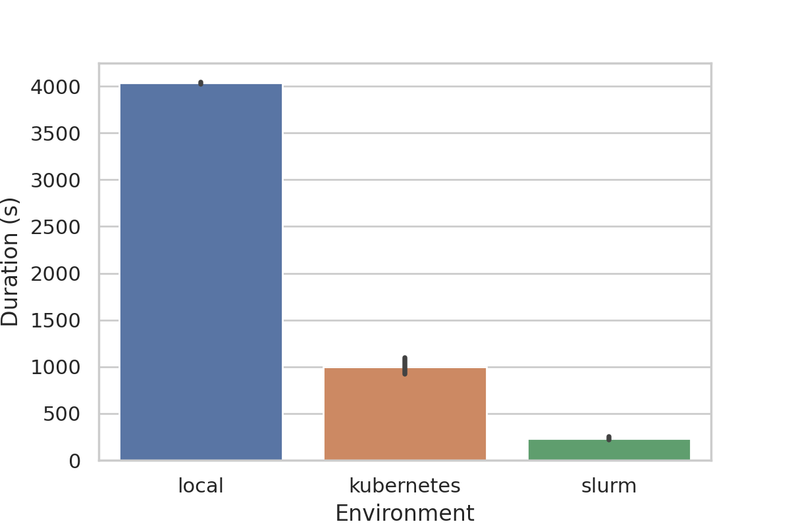

# Introduction {#sec:intro}

<!-- defining the problem of reproducibility in computational science -->

Researchers working in various domains related to computational and data-intensive science upload experimental artifacts like code, figures, datasets, and configuration files, to open-access repositories like Zenodo [@_zenodo_], Figshare [@_figshare_], or GitHub [@github]. 
According to [@stagge2019assessing], approximately 1% of the artifacts available online are fully reproducible and 0.6% of them are partially reproducible. 
A 2016 study by Nature found that from a group of 1576 scientists, around 70% of them failed to reproduce each other's experiments [@baker2016reproducibility].
This problem occurs mostly due to the lack of proper documentation, missing artifacts, or encountering broken software dependencies.
This results in other researchers wasting time trying to figure out how to reproduce those experiments from the archived artifacts, ultimately making this process inefficient, cumbersome, and error-prone [@sep-scientific-reproducibility].

<!-- discuss previous work -->

Numerous existing research has tried to address the problem of reproducibility [@goodman2016does] by different means; for example, logging and tracing system calls, using workflow engines, using correctly provisioned shared and public testbeds, by recording and replaying changes from a stable initial state, among many others [@reproducibility2018acm].
These approaches have led to the development of various tools and frameworks to address these problems of reproducibility [@piccolo2016tools; @peng2011reproducible], with scientific workflow engines being a predominant one [@stevens2013automated; @banati2015minimal; @qasha2016framework].
A workflow engine organizes the steps of a scientific experiment as the nodes of a directed acyclic graph (DAG) and executes them in the correct order [@albrecht2012makeflow].
Nextflow [@ditommaso_nextflow_2017], Pegasus [@deelman_pegasus_2004] and Taverna [@oinn_taverna_2004] are examples of widely used scientific workflow engines.
But some phenomena like unavailability of third-party services, missing example input data, changes in the execution environment, insufficient documentation of workflows make it difficult for scientists to reuse workflows, resulting in _workflow decay_ [@workflow_decay].

<!-- attempts to solves using containers and what problem still remains -->

One of the main reasons behind _workflow decay_ is the difficulty in reproducing the environment where a workflow is developed and originally executed [@meng2017facilitating]. 
Virtual machines (VM's) can be used to address this problem, as its isolation guarantees make it suitable for running steps or the entirety of a workflow inside a separate VM [@howe2012virtual; @virtandnestedvirt2012].
A VM is typically associated with large resource utilization (e.g. long start times and high memory usage), making OS-level virtualization technologies a better-suited tool for reproducing computational environments with fewer overheads [@barik2016performance; @sharma2016containers]. 
Although software (Linux) containers are a relatively old technology [@menage_adding_2007], it was not until recently, with the rise of Docker, that they entered mainstream territory [@bernstein_containers_2014]. 

Docker has been a popular container runtime for a long time, with other container runtimes such as Singularity [@kurtzer_singularity_2017], Rkt [@rktcommunity_rkt_2019], Charliecloud [@priedhorsky_charliecloud_2017], and Podman [@podmancommunity_containers_2019] having emerged. 
With containers, the container-native software development paradigm emerged, which promotes the building, testing, and deployment of software in containers, simultaneously giving rise to the practice of running scientific experiments inside containers to make them platform independent and reproducible [@jimenez:woc15; @stubbs2016endofday; @zheng_integrating_2015]. 
Differences among container engines stem from the need to serve distinct use cases, manifesting in user experience (UX) differences such as those found in their command-line interfaces (CLIs), container image formats; security requirement and environmental differences such as Podman for enhanced security and Singularity for use in HPC, etc.
In practice, for users attempting to make use of container technology, these differences can be overwhelming, especially if they are only familiar with the basic concepts of how containers work. 
Based on our analysis of the container tooling landscape, we found that there is an absence of tools for allowing users to work with containers in an engine-agnostic way. 
It has also been found that as scientific workflows become increasingly complex, continuous validation of the workflows which is critical to ensuring good reproducibility, becomes difficult [@deelman2018future; @cohen2017scientific].

Currently, different container-based workflow engines are available but all of them assume the presence of a fully provisioned Kubernetes cluster [@kubernetes_google].
The presence of a Kubernetes cluster or a cloud computing environment reduces the likelihood of researchers to adopt container technology for reproducing any experiment since it is often costly [@rodriguez2020container] to get access to one and this, in turn, makes reproducibility complex. 
It would be more convenient for researchers if workflow engines provided the flexibility of running workflows in a wide range of computing environments including those that are readily available for them to use.

<!-- our contributions -->

Popper[^popper1] is a lightweight workflow execution engine that allows users to follow the container-native paradigm for building and running reproducible workflows from archived experimental artifacts.
This paper makes the following contributions:

1. The design and architecture of a container-native workflow engine that abstracts over container engines, image builders, and resource managers, giving users the ability to focus on Dockerfiles (software dependencies) and workflow logic, without having to invest time in runtime specific details.

2. Popper, an implementation of the above design that allows running workflows inside containers in different computing environments like local machines, Kubernetes clusters, or HPC environments.

3. A case study on how Popper can be used to quickly reproduce complex workflows in different computing environments.
   We show how an entire machine learning workflow can be executed on a local machine during development, and how it can be scaled up by reproducing it in a Kubernetes cluster with nodes that have GPUs available in them.
   We also show how the same workflow can be reproduced easily in a Slurm [@slurm] cluster in order to scale it up further.

[^popper1]: The version of Popper described in this article is a major overhaul of an earlier version of Popper [@jimenez2017popper]. See @Sec:previous-popper for more.

# Popper {#sec:popper}

In this section, we describe the motivation behind Popper, provide background, and then introduce its architectural design and implementation.

## Motivation

Let us take a relatively simple scenario where users have a list of single-purpose tasks in the form of scripts and they want to automate running them in containers in some sequence.
To accomplish this goal of running a list of containerized tasks using existing workflow engines, users need to learn a specific workflow language, deploy a workflow engine service, and learn to execute workflows on that service.
These tasks may not be always trivial to accomplish if we assume the only thing users should care about is writing experimentation scripts and running them inside containers.
Assume we have three scripts `download_dataset.py`, `verify_dataset.sh`, and `run_training.sh` to download a dataset, verify its contents and run a computational step.
In practice, when developers work following the container-native paradigm they end up interactively executing multiple Docker commands to build containers, compile code, test applications, or deploy software.
Keeping track of which commands were executed, in which order, and which flags were passed to each, can quickly become unmanageable, difficult to document, error-prone, and hard to reproduce.

The goal of Popper is to bring order to this chaotic scenario by providing a framework for clearly and explicitly defining container-native tasks and to launch them, and track their completion.
Running workflows on dissimilar environments like Kubernetes and Slurm incurs multiple operational overheads like adopting environment-specific commands, writing job scripts and definitions, dealing with different image formats like the flat image format of Singularity, etc. which are peculiar to a specific computing environment.
For example, running a containerized step on Kubernetes would require writing pod and volume specifications and creating them using a Kubernetes client.
Likewise, running an MPI workload inside a Singularity container on Slurm would require creating job scripts and starting the job with `sbatch`.
Popper mitigates these environment-specific overheads by abstracting the different implementation details and provides an uniform interface that allows users to write workflows once and reuse them on different environments with tweaks to the configuration file.

## Design Principles {#sec:principles}

The design of Popper is based on the following principles:

  * **Fully embrace the container-native paradigm**.
    Every step of a workflow executes inside a container.

  * **Dockerfile and OCI images as lowest common denominators**.
    All available container engines support generating Open Container Initiative (OCI) images from Dockerfiles, as well as importing or exporting these to other formats; most support the Docker registry API as well. This common denominator allows Popper to abstract over runtimes, engines, builders, and orchestrators.

  * **Be as lightweight as possible but not lighter**.
    The syntax for defining container-native workflow languages should be simple enough that it can be learned in seconds, and meant to be as close to shell scripts as possible.a

  * **Codify the workflow at the highest level**.
    Automate the workflow that we currently observe in the form of README files; documentation that explains how to compile, run, and test a software project; or artifact descriptions in academic articles describing how to reproduce results. In other words, the goal is _not_ to replace existing, more comprehensive workflow engines such as scientific workflow engines, configuration management frameworks, or domain-specific experiment management tools; rather, the goal is to have a thin wrapper around them.

## Background

In this subsection, we provide background on the different tools and technologies that Popper leverages in order to provide the ability of running engine- and resource manager-agnostic container-native workflows.

### Docker

Docker is an OS-level virtualization technology that was released in early 2013.
It uses various Linux kernel features like namespaces and cgroups [@rosen2013resource] to segregate processes so that they can run independently.
It provides state of the art isolation guarantees and makes it easy to build, deploy, and run applications using containers following the OCI (Open Container Initiative) [@oci] specifications. 
However, it was not designed for use in multi-user HPC environments and also has significant security issues [@yasrab2018mitigating], which might enable a user inside a Docker container to have root access to the host system's network and filesystem, thus making it unsuitable for use in HPC systems. 
Docker uses Linux's cgroups to isolate containers, which conflicts with the Slurm scheduler since it also uses cgroups to allocate resources to jobs and enforce limits [@brayford2019deploying].

### Singularity

Singularity is a daemon-less scientific container technology built by LBNL (Lawrence Berkley National Laboratory) and first released in 2016. 
It is designed to be simple, fast, secure, and provides containerized solutions for HPC systems supporting several HPC components such as resource managers, job schedulers and contains native MPI [@mpi1993] features. 
One of the main goals of Singularity is to bring container technology and reproducibility to the High-Performance Computing world. 
The key feature that differentiates it from Docker is that it can be used in non-privileged computing environments like the compute nodes of HPC clusters, without any modifications to the software. 
It also provides an abstraction that enables using container images from different image registries interchangeably like Docker Hub, Singularity Hub, and Sylabs Cloud.
These features make Singularity increasingly useful in areas of Machine learning, Deep learning, and other data-intensive applications where the workloads benefit from HPC systems.

### Slurm

Slurm is an open-source cluster resource management and job scheduling system developed by LLNL (Lawrence Livermore National Laboratory) for Linux clusters ranging from a few nodes to thousands of nodes. 
It is simple, scalable, portable, fault-tolerant, secure, and interconnect agnostic. 
It is used as a workload manager by almost 60% of the world's top 500 supercomputers [@ibrahim2017algorithms]. 
Slurm provides a plugin-based mechanism for simplifying its use across different computing infrastructures.
It enables both exclusive and non-exclusive allocation of resources like compute nodes to the users. 
It provides a framework for starting, executing, and monitoring parallel jobs on a set of allocated nodes and arbitrate conflicting requests for resources by managing a queue of pending work. 
Slurm runs as a daemon in the compute nodes and also provides an easy to use CLI interface.

### Kubernetes

Kubernetes is a production-grade open-source container orchestration system written in Golang that automates many of the manual processes involved in deploying, scaling, and managing of containerized applications across a cluster of hosts. 
A cluster can span hosts across public, private, or hybrid clouds. 
This makes Kubernetes an ideal platform for hosting cloud-native applications. 
Kubernetes supports a wide range of container runtimes including Docker, Rkt, and Podman. 
It was originally developed and designed by engineers at Google and it is hosted and maintained by the CNCF (Cloud Native Computing Foundation). 
Many cloud providers like GCP, AWS, and Azure provide a completely managed and secure hosted Kubernetes platform.

### Continuous Integration

Continuous Integration is a software development paradigm where developers commit code into a shared repository frequently, ideally several times a day.
Each integration is verified by automated builds and tests of the corresponding commits.
This helps in detecting errors and anomalies quickly and shortens the debugging time [@virmani2015understanding].
Several hosted CI services like Travis [@travis], Circle [@circleci], and Jenkins [@jenkins] make continuous integration and continuous validation easily accessible.

## Workflow Definition Language

YAML [@ben2009yaml] is a human-readable data-serialization language. 
It is commonly used in writing configuration files and in applications where data is stored or transmitted. 
Due to its simplicity and wide adoption [@yaml_wide_adoption], we chose YAML for defining Popper workflows and for specifying the configuration for the execution engine. 
An example Popper workflow is shown in @Lst:wf-example which downloads a dataset in CSV format and generates its transpose.

```{#lst:wf-example .yaml caption="A two-step workflow that downloads a CSV table and obtains its transpose."}
steps:
# download CSV file with data on global CO2 emissions
- id: download
  uses: docker://byrnedo/alpine-curl:0.1.8
  args: [-L, https://git.io/JUcRU, -o, global.csv]

# obtain the transpose of the global CO2 emissions table
- id: get-transpose
  uses: docker://getpopper/csvtool:2.4
  args: [transpose, global.csv, -o, global_transposed.csv]
```

A Popper workflow consists of a series of syntactical components called steps, where each step represents a node in the workflow DAG, with a `uses` attribute specifying the required container image. 
The `uses` attribute can reference Docker images hosted in container image registries; filesystem paths for locally defined container images (Dockerfiles); or publicly accessible GitHub repositories that contain Dockerfiles. 
The commands or scripts that need to be executed in a container can be defined by the `args` and `runs` attributes. 
Secrets and environment variables needed by a step can be specified by the `secrets` and `env` attributes respectively for making them available inside the container associated with a step.
The steps in a workflow are executed sequentially in the order in which they are defined.
As can be seen in @Lst:wf-example, Popper workflows are extremely simple with a linear sequence of steps without any loops, conditionals, retries, or waits.

## Workflow Execution Engine

The Popper workflow execution engine[^popperrepo] is composed of several components that talk to each other during a workflow execution.
The vital architectural components of the system are described in detail throughout this section.
The architecture of the Popper workflow engine is shown in @Fig:arch;

[^popperrepo]: `https://github.com/getpopper/popper`

### Command Line Interface (CLI)

Besides allowing users to communicate with the workflow runner, the CLI generates configuration files for continuous integration systems such as Travis or Jenkins, so that users can continuously validate their workflows;
provides dynamic workflow variable substitution capabilities, among others.

### Workflow Definition and Configuration Parsers

The workflow file and the configuration file are parsed by their respective parser plugins at the initial stages of the workflow execution.
The parsers are responsible for reading and parsing the YAML files into an internal format;
running syntactic and semantic validation checks;
normalizing the various attributes and generating a workflow DAG.
The workflow parser has a pluggable architecture that allows adding support to other workflow languages.

### Workflow Runner

The Workflow runner is in charge of taking a parsed workflow representation as input and executing it.
It also downloads actions referenced by the steps in a workflow, checks the presence of secrets that are required by a workflow, and routes the execution of a step to the configured container engine through the requested resource manager. 
The runner also maintains a cache directory to optimize multiple aspects of execution such as avoid cloning repositories if they have been already cloned previously. 
Thus, this component orchestrates the entire workflow execution process.

### Resource Manager and Container Engine API

Popper supports running containers in both single-node and multi-node cluster environments. 
Each of these different environments has a very specific job and process scheduling policies. 
The resource manager API is a pluggable interface that allows the creation of plugins (also referred to as runners) for distinct job schedulers (e.g. Slurm, HTCondor) and cluster managers (e.g. Kubernetes, Mesos [@hindman2011mesos]).
Currently, plugins for Slurm and Kubernetes exist, as well as the default local runner that executes workflows on the local machine where Popper is executed.
Resource manager plugins provide abstractions for different container engines which allows a particular resource manager to support new container engines through plugins.
For example, in the case of Slurm, it currently supports running Docker and Singularity containers but other container engines can also be integrated like Charliecloud [@charliecloud] and Pyxis [@pyxis].
The container engine plugins abstract generic operations that all engines support such as creating an image from a `Dockerfile`;
downloading images from a registry and converting them to their internal format;
and container-level operations such as creation, deletion, and renaming.
Currently, there are plugins for Docker, Podman, and Singularity, with others planned by the Popper community.

The behavior of a resource manager and a container engine can be customized by passing specific configuration through the configuration file.
This enables the users to take advantage of engine and resource manager specific features in a transparent way.
In the presence of a `Dockerfile` and a workflow file, a workflow can be reproduced easily in different computing environments only by tweaking the configuration file.
For example, a workflow developed on the local machine can be run on an HPC cluster using Singularity containers by specifying information like the available MPI library and the number of nodes and CPUs to use for running a job in the configuration file.
The configuration file can be passed through the CLI interface and can be shared among different workflows.
It can either be created by users or provided by system administrators.

{#fig:arch}

## Workflow Exporter

Popper allows exporting a workflow to other workflow specification formats such as CWL [@amstutz2016common] and WDL [@_openwdl_], as well as those associated with a CI service (e.g. Travis) or workflow engine (e.g. Airflow [@airflow]).
In most cases, the workflow specification syntax for these formats is more complex from that one of Popper's, mainly due to the fact that Popper workflow's syntax is fairly minimal and high-level, so it is always the case that a Popper workflow can be written in another existing format that supports containerized workflows.
This prevents lock-in of workflows by Popper as workflows that are written initially for Popper can be exported to other formats and executed on other workflow engines or CI tools.
Exporting to other formats is handled by an extensible Workflow Exporter module that allows creating exporters for an arbitrary list of workflow specification formats. 
Currently, plugins for CI services like TravisCI, CircleCI, Jenkins, and Gitlab-CI are implemented.

# Case Study {#sec:casestudy}

In this section, we present a case study demonstrating how the Popper workflow engine allows reproducing and scaling workflows in different computing environments.
This study aims to emphasize on how Popper can help in mitigating the reproducibility issues and make life easier for researchers and developers.
For this study, we built an image classification workflow that runs the training using Horovod [@horovod] and Keras [@gulli2017deep] over the MNIST [@deng2012mnist] dataset having 3 steps; download; verify; and train.
The workflow used for the case study is depicted in @Lst:casestudy.
The code that the workflow references can be found in the repository [^code] associated with this paper.

The `download-dataset` step downloads the MNIST dataset in the workspace.
The `verify-dataset` step verifies the downloaded archives against precomputed checksums.
The `run-training` step then starts training the model on this downloaded dataset and records the duration of the training.
The download and train steps use a Horovod image and the verify step uses a lightweight alpine image.
Although a single Docker image can be used in all the steps of a workflow, we recommend using images specific to the purpose of a step otherwise it could make dependency management complex, hence defeating the purpose of containers.

```{#lst:casestudy .yaml caption="Workflow used in the case study."}
steps:
# download the MNIST dataset
- id: download-dataset
  uses: docker://horovod/horovod:0.19.3-tf2.1.0-torch-mxnet1.6.0-py3.6-gpu
  runs: [python]
  args: [./workflows/mnist/scripts/download_dataset.py]

# verify the dataset against checksums
- id: verify-dataset
  uses: docker://alpine:3.9.5
  args: [./workflows/mnist/scripts/verify_dataset.sh]

# run training on the dataset
- id: run-training
  uses: docker://horovod/horovod:0.19.3-tf2.1.0-torch-mxnet1.6.0-py3.6-gpu
  args: [./workflows/mnist/scripts/run_training.sh]
  env:
    NUM_EPOCHS: '1'
    BATCH_SIZE: '128'
    DATASET_REDUCTION: '0.1'
```

The general paradigm for building reproducible workflows with Popper usually consists of the following steps:

1. Thinking of the logical steps of the workflow.

2. Finding the relevant software packages required for the implementation of these steps.
   * Finding images containing the required software from remote image registries like DockerHub, Quay.io, Google Container Registry, etc.
   * If a prebuilt image is not available, a `Dockerfile`, which is a file containing specifications for building Docker images, can be used to build an image manually.

3. Running the workflow and refining it.

[^code]: `https://github.com/ivotron/popper-canopie-paper`

## Workflow execution on the local machine

Popper aids researchers in writing, testing, and debugging workflows on their local development machines.
Researchers can iterate quickly by making changes and executing the `popper run` command to see the effect of their changes immediately.
We used an Apple Macbook Pro Laptop with a 2.4GHz quad-core Intel Core i5 64-bit processor and 8Gb LPDDR3 RAM for this case.
The image classification workflow was run on the MNIST dataset using Docker as the container engine.
On single node machines, Popper leaves the job of scheduling the containerized steps to the host machines OS.
We ran the workflow 5 times with an overfitting patience of 5 on the laptop's CPU.
To make the training faster, it should be ideally done on GPUs on the cloud which requires these workflows to be easily portable to multi-node cloud environments.

## Workflow execution in the Cloud using Kubernetes

```{#lst:travis .yaml caption="Travis configuration generated by Popper."}
dist: "xenial"
language: "python"
python: "3.8"
services: "docker"
install: "pip install popper"
script: "popper run -f wf.yml"
```

In this section, we discuss how we reduced the training duration in the above workflow by reproducing it on a GPU enabled Kubernetes cluster.
On Kubernetes clusters, steps of a Popper workflow run in separate pods that can get scheduled on any node of the cluster in a separate namespace.
Popper first builds the images required by the workflow and pushes them to an online image registry like DockerHub, Google Container Registry, etc.
Then a `PersistentVolumeClaim` is created to claim persistent storage space from a shared filesystem like NFS [@sandberg1985design] for the different step pods to share and the workflow context consisting of scripts, configs, etc. is copied into it.
Finally, for each step of the workflow, a pod is created that binds to the shared volume and the corresponding scripts or commands are executed inside the pod.
Although any Kubernetes cluster can be used, for this case, we used a 3-node Kubernetes cluster on CloudLab [@CloudLab] each with an NVIDIA 12GB PCI P100 GPU.
The training pod used the single GPU of the node on which it was scheduled.
Reproducing a locally developed workflow on a Kubernetes cluster only requires changing the resource manager specifications in the configuration file like specifying Kubernetes as the requested resource manager, specifying the `PersistentVolumeClaim` size, the image registry credentials, etc.
In our case, we configured the training with an overfitting patience of 5, similar to what was done for the local machine execution.
The training can be speed up further by scheduling the workflow on multiple nodes to utilize the processing power of multiple GPUs.

## Workflow execution in Slurm clusters

For running workflows on Slurm clusters, container engines that are HPC aware, like Singularity, Charliecloud, and Pyxis need to be used.
Currently, Popper supports running MPI workloads only through Slurm using Singularity as the container engine.
To run workflows on a Slurm cluster, a configuration file containing Slurm specific options like the number of CPUs or nodes to use for running a job needs to be supplied to the `popper run` command.
The user should be aware of the availability of resources like the nodes, CPUs, and GPUs on a shared cluster to write the Popper configuration file accordingly.
The Slurm resource manager builds or pulls an image on the login node of a Slurm cluster and then starts executing the containerized MPI workload on the compute nodes using the `sbatch` command, which creates and schedules a job for running the container on Slurm.
With Singularity as the container engine, both the hybrid and bind method can be used to run a Singularity container with MPI available inside it.
Using the bind approach provides the benefit of making the same MPI based Singularity image compatible between Slurm clusters with different MPI versions.
In our case study, we used 3 VMs from Azure each with an NVIDIA 12GB PCI P100 GPU running Ubuntu 18.04 to create a Slurm cluster with 1 login and 2 compute nodes.
We used `mpich` which is a popular implementation of MPI, with Singularity following the bind approach, where we install MPI on the host and then bind mount the `/path/to/mpi/bin` and `/path/to/mpi/lib` of the MPI package inside the Singularity container for the MPI version in the host and the container to stay consistent.
The training step was run using MPI on the 2 compute nodes having a GPU each and the training parameters were the same as in the previous executions.
<!--`TODO`: an ending note for this paragraph-->

## Workflow execution on CI

{#fig:casestudies}

We used the workflow exporter to generate a Travis configuration file, pushed our MNIST project to GitHub with the configuration, and activated the repository on Travis to run our workflows on CI.
For long-running workflows like those consisting of ML/AI or BigData workloads, it is recommended to scale down various parameters like dataset size, epochs, etc. with the help of environment variables to reduce the CI running time and iterate quickly. 
We declared environment variables like `NUM_EPOCHS`, `DATASET_REDUCTION`, and `BATCH_SIZE` to control the number of epochs, size of training data, and batch size respectively in our workflow.
Using the above variables we used only 10% of the dataset and configured the training for a single epoch, thus effectively reducing our CI running time by approx. 75%.
The `.travis.yml` file used by our case study is shown in @Lst:travis.
It can be generated by running `popper ci travis` from the command line.
By setting up CI for Popper workflows, users can continuously validate changes made to their workflows and also protect their workflows from getting outdated due to reasons such as outdated dependencies, outdated container images, and broken links.

```{#lst:kubernetes .yaml caption="Configuration file for running on Kubernetes."}
resource_manager:
  name: kubernetes
  options:
    volume_size: 4Gi
    namespace: mynamespace
```

# Results {#sec:results}

The results obtained from executing the workflow in the different computing environments have been shown in @Fig:casestudies.
We can see that the training duration drastically reduced, by almost 75% as we went from running the workflow on the local machine to running on Kubernetes.
We achieved further speedup by moving the workflow execution to Slurm where we used 2 GPUs from 2 different nodes instead of 1 GPU as in the case of Kubernetes.
Also, Popper allowed us to scale our workflow down and run it on CI to continuously validate the workflow.
These case studies show how Popper helps improve the performance of scientific workflows and boost developer productivity by allowing seamless reproduction on cloud and HPC infrastructure.

# Discussion {#sec:discussions}

The case study showcased the benefits of using Popper: having portable workflows drastically reduces software development and debugging time by enabling developers and researchers to quickly iterate and test the same workflow logic in different computing environments.
To expand on this point, we analyzed the GitHub repository [^mlperf] of MLPerf [@mattson2019mlperf], a benchmark suite that measures how fast a system can train ML models.
From a total of 123 issues, 67 were related to problems of reproducibility: missing or outdated versions of dependencies, documentation not aligning with the code, missing or broken links for datasets; etc.
Popper can solve much of the problems generally noticed while reproducing research artifacts like the ones we found.

As exemplified in the use cases, Popper helps build workflows that can be run on Cloud and HPC environments besides the local machine with minimal changes in configuration in a sustainable fashion.
The adjustments that users need to make to reproduce workflows on Kubernetes and Slurm is described below.

1. To run workflows on Kubernetes clusters, users need to pass some configuration options through a YAML file with contents similar to the one shown in @Lst:kubernetes. 
   The `volume_size` and `namespace` options are not required if the defaults are suitable for running the workflow but we show it here to depict some ways in which the Kubernetes resource manager can be customized.

2. Similarly, for running workflows on Slurm, users need to specify a few 
   configuration options like the number of nodes to use for running 
   the job concurrently, the number of CPUs to allocate to each task, 
   the MPI library to bind to, etc. as shown in @Lst:slurm.

```{#lst:slurm .yaml caption="Configuration file for running on Slurm."}
engine:
  name: singularity
  options:
    bind: [/path/to/mpi/lib:/usr/lib/,
           /path/to/mpi/bin:/usr/bin/]

resource_manager:
  name: slurm
  options:
    run-training:
      nodes: 2
      nodelist: worker1,worker2
      cpus-per-task: 2
```

The configuration files are orthogonal to the workflow and are only meant to provide
environment-specific options to allow running the same workflow in different environments.
It can be seen that with few tweaks like changing the resource manager 
options in the configuration file, a workflow developed on a local 
machine can be executed on Kubernetes and Slurm clusters.
In this way, Popper allows researchers and developers to build and test workflows in different computing environments with relatively minimal effort.

[^mlperf]: `https://github.com/mlperf/training`

# Related Work

The problem of implementing multi-container workflows as described in @Sec:intro is addressed by several existing tools.
We briefly survey some of these tools and technologies and compare them with Popper by grouping them in categories.

## Workflow definition languages

Standard workflow definition languages like CWL, WDL, and YAWL [@van2005yawl] provide an engine agnostic interface for specifying workflows declaratively. 
Being engine agnostic, different workflow engines can adopt these languages as these workflow languages provide a plethora of useful syntactic elements to support a wide range of workflow engine features.
Some of these workflow definition languages provide syntax for fine-grained control of resources by the users like defining the amount of CPU and memory to be allocated to each step, specifying scheduling policies, etc.
Most of these languages support syntax for integration with various computing backends like container engines (e.g. Docker, uDocker [@gomes2018enabling], Singularity), HPC clusters (e.g. HTCondor [@tannenbaum2001condor], LSF [@wei2005implementing], Slurm), cloud providers (e.g. AWS, GCP, Azure), Kubernetes, etc.
For a user whose primary goal is to automate running a set of containerized scripts in sequence, learning these new workflow languages and syntaxes might add to the overall complexity.
One of Popper's primary goals is to minimize the workflow language overhead as much as possible by allowing users to specify workflows using vanilla YAML syntax, thus keeping the learning curve flat and preventing sources of confusion.

## Workflow execution engines

Workflow execution engines can be categorized in several different categories.
In this section, we discuss a few frequently used categories of workflow execution engines namely Generic, Cloud Native, Container Native, and CI and compare their pros and cons with Popper.

### Generic workflow execution engines

Few examples of this category are stable and mature scientific workflow engines like Nextflow, Pegasus, and Taverna which have recently introduced support for running steps in software containers.
Also in this category are frameworks that support, in addition to defining workflows, executing and sharing them, for example, CK [@grigori_fursin_2020], REANA [@vsimko2019reana], OpenML [@vanschoren2014openml], among others [@isdahl2019out].
Popular workflow engines like Airflow and Luigi [@_luigi_] require specifying workflows using programming languages and also provide pluggable interfaces that require the installation of separate plugins.
For example, Airflow and Luigi use Python, Copper [@_copper_engine_] uses Java, Dagr [@_dagr_] uses Scala and SciPipe [@lampa2019scipipe] uses Go as their workflow definition language.
The goal with Popper is to minimize overhead both in terms of workflow language syntax and infrastructural requirements for running workflows and hence allow users to focus solely on writing the workflows.
The first issue is already addressed in the previous subsection, but it's also relevant here because not all engines support standard workflow languages such as CWL, and also learning specific programming languages for workflow execution seems like an exaggeration.
Most of these popular workflow engines like Pegasus, Airflow, and Luigi also require a standalone service that users need to learn how to deploy and interact with before executing workflows, thus adding to the complexity.
Popper also mitigates this issue as it can be downloaded and run as a standalone executable and does not assume any service deployment or infrastructural management before running workflows.

### Container-native workflow execution engines

The container-native paradigm encourages shifting the entire software development lifecycle which includes building, testing, debugging, and deployment to within software containers.
The workflow engines that assume running steps of a workflow inside separate containers are usually termed as container-native workflow engines.
Streamflow [@_streamflow_], Flyte [@_flyte_], and Dray [@_dray_] are some well-known examples of container-native workflow execution engines. 
Some of these container-native workflow engines like Flyte and Dray are built around a client-server architecture requiring some service deployment effort before being able to run workflows on them.
Popper falls in this category of container-native workflow engines but it does not assume any service deployment before running workflows, hence mitigating any extra service maintenance overhead or cost.

### Cloud-native workflow execution engines

Cloud-native computing is an emerging paradigm in software development that aims to utilize existing cloud infrastructure to build, run, and scale applications in the cloud.
The cloud-native paradigm is a subset of the container-native paradigm since it encourages running applications not only inside containers but also on cloud infrastructure.
Container engines like Docker and orchestration tools like Kubernetes have become an integral part of the cloud-native paradigm over the years.
With the wide-spread acceptance of the cloud-native paradigm, several cloud-native workflow engines like  Argo [@argocommunity_argoproj_2019], Pachyderm [@novella_containerbased_2018], Brigade [@brigade] have come into existence.
These workflow engines facilitate running workflows on the cloud by running an entire workflow in containers managed by Kubernetes.
The limitation of these workflow engines is the requirement of having access to a Kubernetes cluster which can block users from running workflows in the absence of one.
Although Popper can run workflows on the cloud using Kubernetes, it does not necessarily require access to a Kubernetes cluster for running the containerized steps of a workflow.
Popper is not exclusively cloud-native since it does not assume the presence of a Kubernetes cluster for running workflows, but in addition to being able to work as cloud-native i.e. run workflows on Kubernetes, it can also behave as container-native in different computing environments like a local machine, Slurm and cloud VM instances over SSH.

## Continuous Integration Tools

Continuous Integration is a DevOps practice that enables building and testing code frequently to prevent the accumulation of broken code and support faster development cycles.
Tools like Travis, Circle, Jenkins, and GitLab-CI have become the standard for doing CI, but they were primarily built for running on the Cloud.
This results in increased iteration time, especially for quick modify-compile-test loops, where the time spent in booting of VMs, scheduling of CI jobs becomes an overhead.
Reproducing experiments on the local machine that originally run on CI services, requires imitating the CI environment locally which makes the entry barrier high.
Running on CI tools hosted locally, like using Gitlab-runner [@gitlabrunner], requires knowledge and expertise in running and using the specific tools.
Popper tackles these problems by providing a workflow abstraction that allows users to write a workflow once and run them interchangeably between different environments like a local machine, CI services, Cloud, and HPC by learning a single tool only.
Given the above, Popper is not intended to replace CI tools, but rather serve as an abstraction on top of CI services, helping to bridge the gap between a local and a CI environment.

## Previous Version of Popper {#sec:previous-popper}

Earlier work [@jimenez2016standing; @jimenez2017popper] introduced a convention for organizing folder and bash scripts inside a Git repository in order to make it easier to reproduce.
A preliminary version of the CLI tool [^popper1xcli] (termed Popper 1.x) aided in the execution of experiments that followed this convention.
In practical terms, by prescribing a fixed folder layout, the convention resulted in having a single, hard-coded workflow with each step represented by a bash script.
This earlier Popper 1.x version did not assume containers, and instead left to the user the task of reproducing the environment.
In contrast, the Popper container-native engine presented here fully embraces the container-native paradigm by implementing the principled design described in @Sec:principles.
Tutorials that introduce attendees to the Popper container-native engine have been held in various workshops [@10.1145/3293883.3302575] and introductory talks.
Additionally, a case study using Popper in computer network experiments was presented in [@david2019reproducible].

[^popper1xcli]: Available in the branch `v1.x` of the official repository: `https://github.com/getpopper/popper/tree/v1.x`.

# Conclusion and Future Work {#sec:conclusionandfuturework}

In this paper, we introduce Popper, a container-native workflow execution engine that aims to solve the reproducibility problem in computational science.
We first describe and analyze the design of Popper's YAML based workflow syntax and the architecture of the Popper workflow engine.
We present a case study for an ML workflow to demonstrate how Popper helps developers and researchers build and test workflows in different computing environments like a local machine, Kubernetes, and Slurm, quickly and with minimal changes in configuration.
Next, we compare Popper with existing state-of-the-art workflow engines illustrating its YAML based workflow syntax that has a relatively low entry barrier and its ability to run containerized workflows without requiring access to any cloud environment.

As future work, we plan the following:

* Add support for more container engines like NVIDIA Pyxis, Charliecloud, Shifter [@gerhardt2017shifter] and resource managers like HTCondor, TORQUE [@staples2006torque] to Popper in order to extend the range of the different computing environments currently supported.

* Add more exporter plugins for exporting Popper workflows to advanced workflow syntaxes such as CWL, WDL, and Airflow to enable interoperability between different workflow engines.

* Currently, Popper supports logging to the STDOUT or a file.
  This can be extended to have an abstract mechanism to store and export logs to logging drivers like syslog [@syslog], fluentd [@fluentd], or AWS CloudWatch [@cloudwatch].
  Similar abstractions can be implemented to support different tracing mechanisms of containers like `dtrace` [@dtrace].

* Add plugins for engines like Kata container [@kata] and Firecracker [@agache2020firecracker] to allow running containers with the isolation guarantees of a VM.

* Building, caching, and layering of images are currently taken care of by the underlying container engine.
  We plan to add an `image` attribute to the Popper workflow syntax to abstract the process of building and pushing images.
  This feature will effectively allow images to be built in an engine-agnostic way, and allow the use of tools such as Kaniko [@kaniko], BuildKit [@buildkit], Buildah [@buildah] among others.
  These tools support rootless image builds and significantly speed up builds by providing remote caching features.

**Acknowledgements**: This work was partially funded by the NSF Awards #OAC-1836650 (IRIS-HEP [^iris-hep]) and #CNS-1705021, as well as by the Center for Research in Open Source Software (CROSS)[^cross].

[^cross]: `https://cross.ucsc.edu`
[^iris-hep]: `https://iris-hep.org`

# References {#sec:references}
\footnotesize
